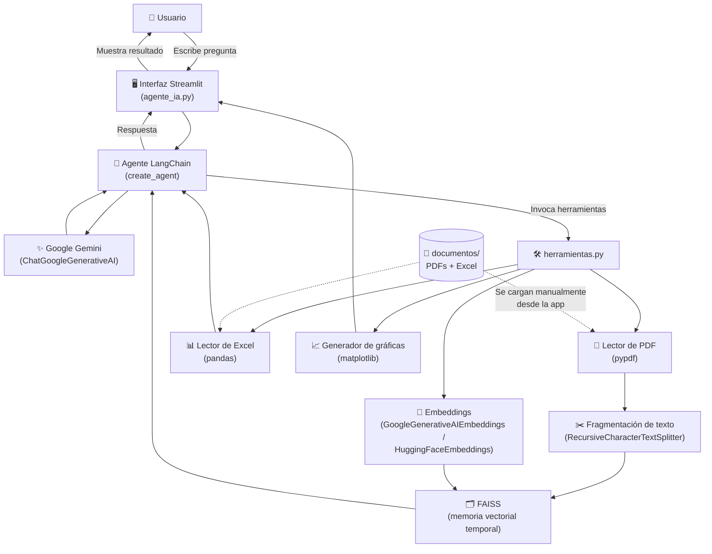
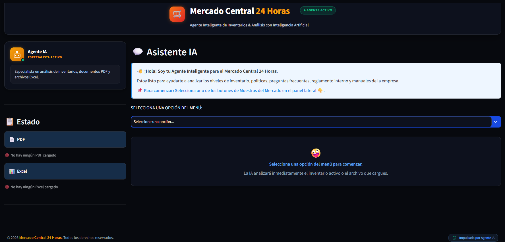
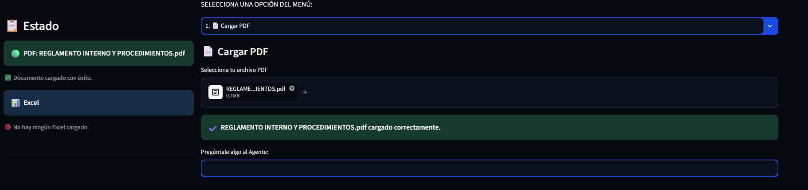
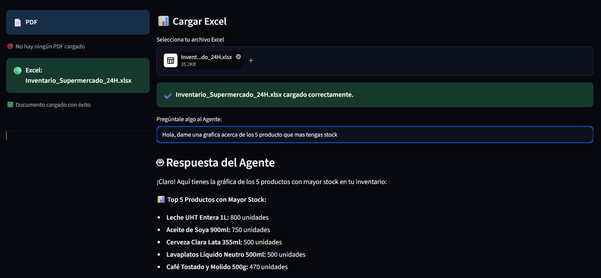
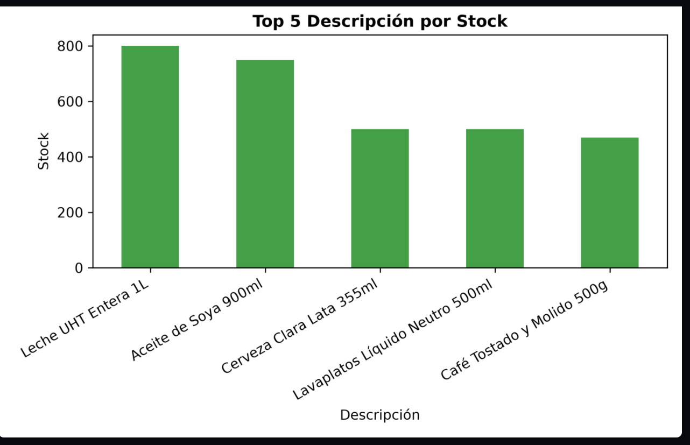

<div align="center">

# 🛒 Agente IA — Mercado Central 24H
### Gestión inteligente de inventario impulsada por IA generativa

*Un asistente conversacional construido con LangChain y Google Gemini para que "Mercado Central 24 Horas" nunca más tenga que buscar información a mano.*

<br/>


</div>

<br/>


---

### 📑 Tabla de contenido
- [Introducción](#-introducción)
- [Objetivo del agente](#-objetivo-del-agente)
- [Arquitectura](#️-arquitectura)
- [Componentes](#-componentes)
- [Estructura del proyecto](#-estructura-del-proyecto)
- [Documentos](#-documentos)
- [Tecnologías utilizadas](#️-tecnologías-utilizadas)
- [Instalación](#-instalación)
- [Ejemplo de uso](#-ejemplo-de-uso)
- [Capturas de pantalla](#️-capturas-de-pantalla)

---

## 📖 Introducción

**Mercado Central 24 Horas** es un supermercado ficticio que necesitaba resolver un problema muy real: su equipo perdía tiempo buscando información dispersa en manuales, políticas, catálogos y hojas de cálculo cada vez que un cliente o un empleado tenía una duda.

Este proyecto nace para resolver justo eso. Es un **agente de inteligencia artificial conversacional**, construido con LangChain y el modelo **Gemini de Google**, capaz de leer, entender y responder preguntas sobre el inventario, las políticas de la tienda y los procedimientos internos, todo desde una interfaz simple hecha en **Streamlit**.

En lugar de buscar manualmente en 6 documentos distintos, el usuario simplemente le pregunta al agente — y el agente responde con base en la información real de la empresa.

## 🎯 Objetivo del agente

El agente fue diseñado para:

- 📦 Consultar el **inventario** de productos (existencias, precios, categorías) desde archivos Excel.
- 📄 Responder preguntas basadas en **documentos PDF** (políticas, reglamentos, manuales, FAQ).
- 📊 **Generar gráficas** automáticamente a partir de los datos del inventario.
- 🧠 Mantener el contexto de la conversación para resolver dudas de forma natural, como lo haría un asesor humano.
- 🔍 Servir como una única fuente de verdad conversacional para empleados y clientes de "Mercado Central 24 Horas".

## 🏗️ Arquitectura



**Flujo resumido:**
1. El usuario sube los documentos necesarios (PDF/Excel) desde la interfaz.
2. El agente, con ayuda de Gemini, decide qué herramienta usar según la pregunta.
3. Si es texto (PDF), se fragmenta, se convierte en embeddings y se busca en FAISS.
4. Si es inventario (Excel), se consulta directamente con pandas.
5. Si se pide una gráfica, se genera con matplotlib y se muestra en pantalla.
6. La respuesta final se entrega al usuario dentro del chat.

## 🧩 Componentes

| Componente | Descripción |
|---|---|
| `agente_ia.py` | Punto de entrada de la app. Define la interfaz en Streamlit y orquesta el agente. |
| `herramientas.py` | Contiene las *tools* del agente: carga y limpieza de PDF/Excel, generación de gráficas, embeddings. |
| `.streamlit/config.toml` | Configuración visual y de comportamiento de la app de Streamlit. |
| `styles.css` | Estilos personalizados para la interfaz. |
| `documentos/` | Carpeta con los archivos fuente que el agente necesita para responder. |
| `.env` | Almacena la `GOOGLE_API_KEY` de forma segura (no se sube al repositorio). |
| `requirements.txt` | Lista de dependencias del proyecto. |

## 📂 Estructura del proyecto

```
PROYECTO_FINAL_AGENTES_IA_ALURA_ONE/
│
├── .streamlit/
│   └── config.toml
│
├── documentos/
│   ├── Inventario_Supermercado_24H.xlsx
│   ├── Manual_de_Proveedores_y_Política_de_Compras.pdf
│   ├── Mercado_Central_24h.txt
│   ├── Politica_Atencion_Cliente_cambios_devoluciones.pdf
│   ├── Preguntas_Frecuentes_(FAQ)_Mercado.pdf
│   └── Reglamento_Interno_Procedimientos.pdf
│
├── venv/                  # Entorno virtual (no se sube al repo)
├── .env                   # Variables de entorno (no se sube al repo)
├── .gitignore
├── agente_ia.py            # App principal (Streamlit)
├── herramientas.py         # Herramientas del agente (tools)
├── requirements.txt
├── styles.css
└── README.md
```

## 📁 Documentos

El agente utiliza los siguientes documentos como base de conocimiento:

| Documento | Tipo | Contenido |
|---|---|---|
| `Inventario_Supermercado_24H.xlsx` | Excel | Existencias, precios y categorías de productos |
| `Manual de Proveedores y Política de Compras.pdf` | PDF | Lineamientos de compras y relación con proveedores |
| `Mercado_Central_24h.txt` | Texto | Información general del supermercado |
| `Politica_Atencion_Cliente_cambios_devoluciones.pdf` | PDF | Política de cambios y devoluciones |
| `Preguntas_Frecuentes_(FAQ)_Mercado.pdf` | PDF | Preguntas frecuentes de clientes |
| `Reglamento_Interno_Procedimientos.pdf` | PDF | Procedimientos y reglamento interno |

> ⚠️ **Importante:** estos documentos se encuentran disponibles dentro de la carpeta [`documentos/`](./documentos) de este mismo repositorio. **Deben adjuntarse manualmente desde la interfaz de la aplicación** antes de interactuar con el agente, ya que **sin ellos el agente no cuenta con la información necesaria para responder**.

## 🛠️ Tecnologías utilizadas

| | Tecnología | Rol en el proyecto |
|---|---|---|
| 🐍 | **Python 3.12** | Lenguaje base del proyecto |
| 🎈 | **Streamlit** | Interfaz web del chat y carga de archivos |
| 🔗 | **LangChain** (`create_agent`) | Orquestación del agente y sus herramientas |
| ✨ | **langchain-google-genai** | Conector entre LangChain y Gemini |
| 🧠 | **Google Gemini** | Modelo de lenguaje (LLM) que razona y responde |
| 🗂️ | **FAISS** | Base de datos vectorial en memoria para búsqueda semántica |
| 📄 | **pypdf** | Extracción de texto de los documentos PDF |
| 🐼 | **pandas** | Lectura y manipulación de los datos del Excel de inventario |
| 📊 | **matplotlib** | Generación de gráficas del inventario |
| 🔐 | **python-dotenv** | Manejo seguro de la API key en `.env` |

## 🚀 Instalación

**1. Clonar el repositorio**
```bash
git clone https://github.com/alejandra-9131/Proyecto-final-Alura-agente-ia-mercado-central-24h.git
cd Proyecto-final-Alura-agente-ia-mercado-central-24h
```

**2. Crear y activar entorno virtual**
```bash
python -m venv venv

# Windows
venv\Scripts\activate

# Mac / Linux
source venv/bin/activate
```

**3. Instalar dependencias**
```bash
pip install -r requirements.txt
```

**4. Configurar variables de entorno**

Crea un archivo `.env` en la raíz del proyecto con tu clave de API de Google:
```
GOOGLE_API_KEY=tu_api_key_aqui
```

**5. Ejecutar la aplicación**
```bash
streamlit run agente_ia.py
```

## 💬 Ejemplo de uso

```
🧑 Usuario: Hola, dame una gráfica acerca de los 5 producto que mas tengas stock
🤖 Agente: ¡Claro! Aquí tienes la gráfica de los 5 productos con mayor 
           stock en tu inventario:

           📊 Top 5 Productos con Mayor Stock:
           • Leche UHT Entera 1L: 800 unidades
           • Aceite de Soya 900ml: 750 unidades
           • Cerveza Clara Lata 355ml: 500 unidades
           • Lavaplatos Líquido Neutro 500ml: 500 unidades
           • Café Tostado y Molido 500g: 470 unidades

           [Genera y muestra la gráfica de barras correspondiente] 📈

🧑 Usuario: ¿Cuál es la política de devoluciones?
🤖 Agente: Según el reglamento interno, los clientes pueden solicitar 
           cambios o devoluciones dentro de los 8 días posteriores 
           a la compra, presentando la factura original...
```

## 🖼️ Capturas de pantalla

**Interfaz principal**

Pantalla de bienvenida del agente, con el estado de los documentos cargados en el panel lateral.



**Carga de documentos**

Selección y carga de un PDF desde el menú — el agente confirma cuando el documento quedó listo para consultarse.



**Gráfica generada por el agente**

El usuario pregunta por los productos con mayor stock y el agente responde con base en el Excel de inventario cargado, generando además la gráfica correspondiente con matplotlib.





---

<div align="center">

## 👩‍💻 Autora

Proyecto desarrollado con 💛 por **Alejandra**
como proyecto final del curso **Agentes de IA — Alura ONE**

*"De seis documentos dispersos a una sola conversación."*

</div>